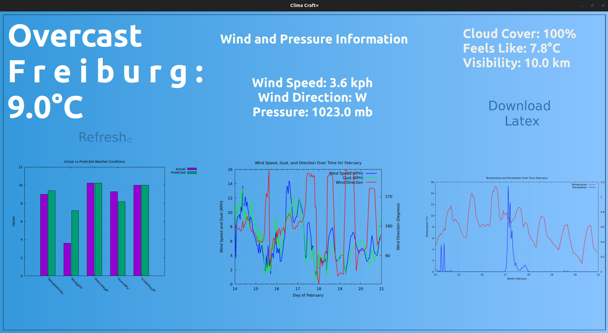
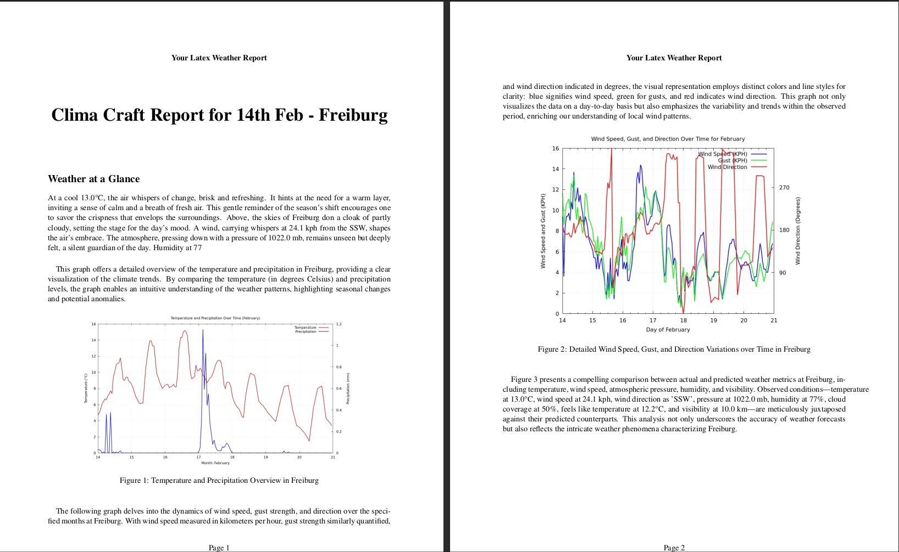

**Author:** Ashwin Vazhappilly  
**Matrikelnummer:** 5575882

# ClimaCraft [](https://github.com/ashdriod/ClimaCraft/actions/workflows/main.yml) [](https://opensource.org/licenses/Apache-2.0)


ClimaCraft is a lightweight Python GTK application designed to fetch and display weather information in a user-friendly
manner. Leveraging data from OpenWeatherMap.org, it presents the weather details through various graphical
representations and provides a unique feature of generating a narrative weather report in a LaTeX PDF document.

## Features

- **Weather Information Display**: Fetches and displays simplified weather information, including wind and pressure
  details, from OpenWeatherMap.org.
- **Graphical Representations**: Utilizes GNUPlot to plot various graphs, showcasing temperature, precipitation, wind
  speed, gust direction, and a comparison between current and forecasted weather conditions.
- **LaTeX PDF Report Generation**: Generates a detailed narrative of the weather information in LaTeX format, which can
  be compiled into a PDF document, offering a printable weather report.

## Installation

Clone this repository and navigate to the project directory. Ensure all the required files are downloaded.

Run the Dockerfile to create the Docker image, which includes the following dependencies:

- **Python 3**: The core language used.
- **gnuplot**: For generating graphical plots.
- **texlive-latex-base**: Basic LaTeX packages.
- **texlive-latex-recommended**: Recommended LaTeX packages.
- **texlive-latex-extra**: Extra LaTeX packages.
- **texlive-fonts-recommended**: Recommended fonts for LaTeX.
- **texlive-science**: LaTeX packages for scientific documents.
- **libgirepository1.0-dev**: For GObject introspection.
- **libgtk-3-dev**: Development files for GTK.
- **gir1.2-gtk-3.0**: GObject introspection data for GTK.

Navigate to the desired directory. If Docker is not installed on your VM or machine, you can install it by executing the
following commands:

```bash
# Make the script executable
chmod +x install_docker.sh

# Execute the script with sudo
sudo ./install_docker.sh
```

After ensuring Docker is installed, build the Docker image with the following command:

```bash
sudo docker build -t climacraft .
```

Once the image is successfully built, you can run the Docker image with this script:

```bash
sudo -E ./run_climacraft.sh
```

## Usage

Upon running the application via the Docker script, an internet connection is required to fetch the weather data. When
you click on the "Download LaTeX" option, the report is generated inside the Docker container. However, the script is
designed to mount the relevant output directory to a downloads folder on your host machine. Therefore, you can find the
generated PDF file, named `weather_report.pdf`, in the specified downloads folder.

**Important Note:**

**However, it's crucial to understand that while the app is running inside the Docker container, the file will only be
accessible in the download folder once you close the app.** This behavior differs from running the application natively,
where files populate in real-time. Therefore, to access the generated report, ensure that you close the application
properly.

## Screenshots

Here are some screenshots showcasing the main window of the application and the LaTeX report output:

- Main Window:
  

- LaTeX Report:
  

## Contributing

Contributions are greatly appreciated. If you have suggestions for improvements or encounter any issues, please feel
free to open an issue first to discuss your ideas or concerns. For minor fixes, pull requests can be made directly. For
major changes, it's best to open an issue first to discuss what you would like to change.

## License

This project is licensed under the Apache License 2.0. This license allows you the freedom to use, modify, and
distribute the software as you see fit, provided that you include the original copyright notice and permission notice in
all copies or substantial portions of the software._
